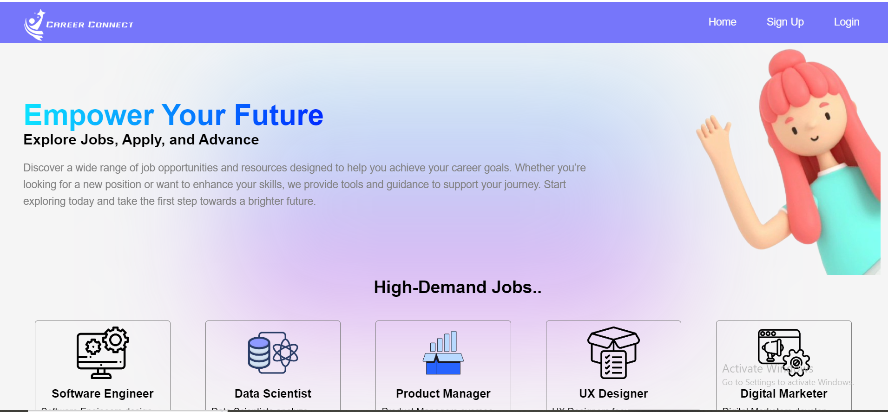

# Project Name : **Career Connect- Job Portal**  
 
### Hire Me is a job portal designed to connect job seekers with potential employers. The platform allows users to create profiles, search for jobs, and apply directly, while employers can post job openings and manage applications.



## Table of Contents

- Features
- Technologies Used
- Installation
- Contribution
- Contact
- Hosting Link

## Features

- User Authentication:  <br>Sign up, log in, and log out functionalities for both job seekers and employers.
- Profile Management: <br>Users can create and edit their profiles.
- Job Search: <br>Browse or search for jobs by location, title, or company.
- Job Application: <br>Submit applications directly through the platform.
- Responsive Design: <br>Optimized for both desktop and mobile users.

## Technologies Used

**1. HTML** <br>
**2. CSS**  <br>
**3. React JS**  <br>

## Installation

1. Clone the repository:

   ```bash
   git clone https://github.com/swaroopatarkase/icp8.0-reactjs-group-project-4


2. Install dependencies <br>
  npm install

3. Start application <br>
  npm start

4. Open your browser and go to http://localhost:3000.


## Contribution


## Contact

Phone no :8999733751

## Hosting Link

The project is hosted on Netlify (https://hiree-meh.netlify.app/).


